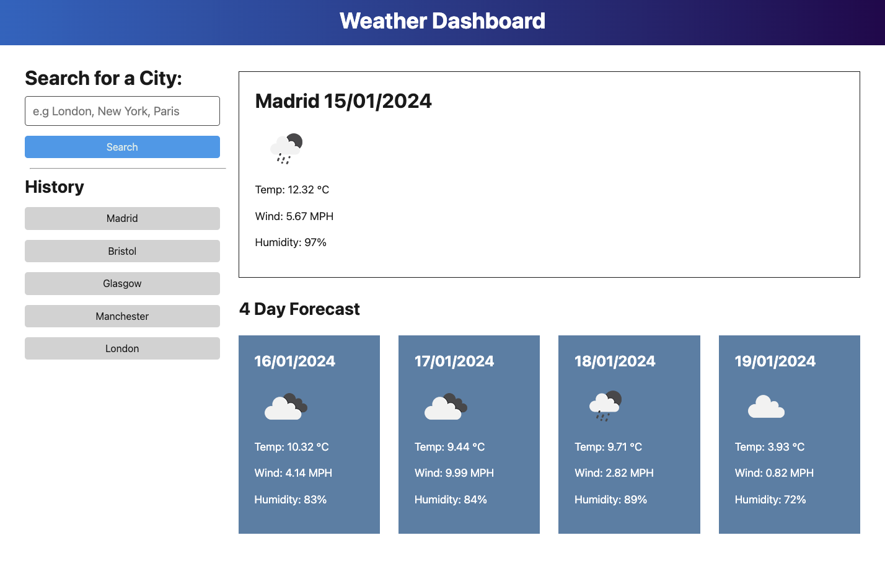

# Weather Dashboard
Module 8 Challenge for EDX Bootcamp

<!-- TABLE OF CONTENTS -->

  
Table of Contents

  <ol>
    <li>
      <a href="#description">Description</a>
      <ul>
        <li><a href="#built-with">Built With</a></li>
      </ul>
    </li>
    <li>
        <a href="#installation">Installation</a>
    </li>
    <li><a href="#usage">Usage</a></li>
    <li><a href="#license">License</a></li>
    <li><a href="#contact">Contact</a></li>
    <li><a href="#acknowledgments">Acknowledgments</a></li>
  </ol>

<!-- ABOUT THE PROJECT -->
## Description

 
 
This was the 8th homework challenge for the EDX Bootcamp in Front End Development.
 

   
Our task was to build a weather dashboard that runs in the browser and features dynamically updated HTML and CSS. The app retrieves data based on user input from the 5 day weather forecast API from OpenWeather, and then renders it to the page as a 5 day forecast.

 

### Built With

* 
* 
* 
* 
* 

## Installation

N/A

<!-- USAGE EXAMPLES -->
## Usage

To use this project, please open the website in Chrome or any other web browser. 

At the top left of the page you should see a search input with City Name suggestions. You can type in a city from any country in the world and click the search button.

You will be presented with today's weather at the top of the page, plus a 4 day forecast below this main element.

Your city will also be added to the history tab on the left, and can be clicked again to re-generate the results. This history tab can be cleared by going to the Application tab in dev tools, and then Local Storage > file, and then by either clicking the No Entry icon to clear or by right clicking and deleting the key/values.

<!-- LICENSE -->
## License

Distributed under the MIT License. See `LICENSE.txt` for more information.

<!-- CONTACT -->
## Contact

Richard Llewellyn - richard.lee.llewellyn@gmail.com 

Project Link: [https://richllew182.github.io/weather-dashboard/](https://richllew182.github.io/weather-dashboard/)

Project Repo Link: [hhttps://github.com/RichLlew182/weather-dashboard](https://github.com/RichLlew182/weather-dashboard)

<!-- ACKNOWLEDGMENTS -->
## Acknowledgments

* [OpenWeather](https://openweathermap.org/forecast5)
* [Jquery](https://api.jquery.com/)
* [Bootstrap](https://getbootstrap.com/docs/5.3/getting-started/introduction/)
* [Img Shields](https://shields.io)
* [Best README Template](https://github.com/othneildrew/Best-README-Template)